# AI-Powered Customer Support & Service Automation

A Salesforce-based solution that automates inspection/case documentation using Einstein Generative AI (Prompt Builder), record-triggered flows, and role-based security — built to reduce manual effort and improve customer support efficiency.

---

## 1. Project Objectives

- Automate creation and management of customer support cases (inspection records) in Salesforce.
- Use Salesforce's built-in Generative AI (Prompt Builder) to auto-generate professional inspection/case summaries.
- Route cases to the correct support team automatically based on priority and issue category.
- Enforce data integrity through validation rules and secure access through field-level security.
- Provide a clean, custom Lightning App interface for end users.

---

## 2. Functional Scope

- **Case/Inspection Management:** Users create and manage support case records (Priority, Status, Issue Category, related Order/Product).
- **AI-Generated Summaries:** A Field Generation Prompt Template (`MetaDataInspection`) generates an AI Summary directly on the record, triggered from the record page.
- **UI Customization:** Lightning App Builder was used to build a dedicated app and embed the AI feature into the record page (Dynamic Forms).
- **Automation:** Record-triggered Flows auto-set case status and route high-priority cases to the appropriate owner/queue.
- **Data Integrity & Security:** Validation rules enforce mandatory fields by case type; field-level security controls access.

---

## 3. Stakeholders

| Stakeholder | Role |
|---|---|
| Project Sponsor | Defines business objectives, approves deliverables |
| Salesforce System Administrator | Configures objects, flows, Prompt Builder, security |
| Inspection Team | Creates/manages case records, uses AI summaries |
| Support Team | Reviews case info, assists customers |
| Management | Reviews reports/dashboards for decision-making |
| IT Support | Maintains system, resolves technical issues |

---

## 4. Data Model

### Customer\_\_c
| Field | Type |
|---|---|
| Customer Name | Text (Record Name) |
| Email | Email |
| Phone | Phone |
| Customer Type | Picklist (Individual, Business) |

### Merchandise\_\_c
| Field | Type |
|---|---|
| Product Name | Text (Record Name) |
| Product Code | Text |
| Category | Picklist |
| Warranty (Months) | Number |
| Active | Checkbox |

### Orders\_\_c
| Field | Type |
|---|---|
| Order Number | Auto Number |
| Order Date | Date |
| Status | Picklist (New, Shipped, Delivered) |
| Customer | Lookup → Customer\_\_c |
| Product | Lookup → Merchandise\_\_c |

### User\_Case\_\_c
| Field | Type |
|---|---|
| Case Number | Auto Number (Record Name) |
| Product | Lookup → Merchandise\_\_c |
| Order | Lookup → Orders\_\_c |
| Priority | Picklist (Low, Medium, High) |
| Issue Category | Picklist (Delivery, Damage, Warranty) |
| Status | Picklist (New, Open, In Progress, Closed) |
| AI Summary | Long Text Area (32,000 chars) — AI-generated |

### Knowledge\_\_c
| Field | Type |
|---|---|
| Article Title | Text (Record Name) |
| Description | Long Text Area |
| Category | Picklist |
| Related Product | Lookup → Merchandise\_\_c |

**Relationships:** Customer → Orders (1:M) · Merchandise → Orders (1:M) · Merchandise → User Case (1:M) · Orders → User Case (1:M) · Merchandise → Knowledge (1:M)

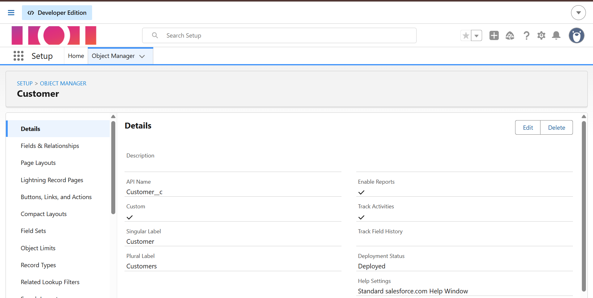
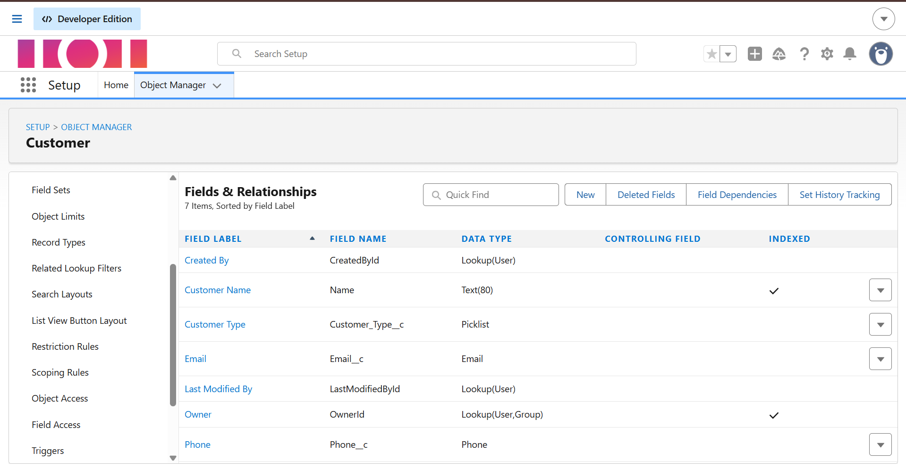
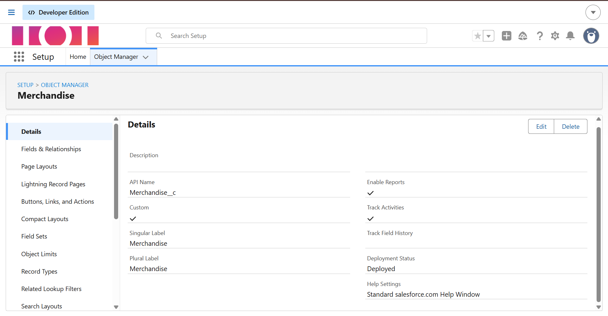
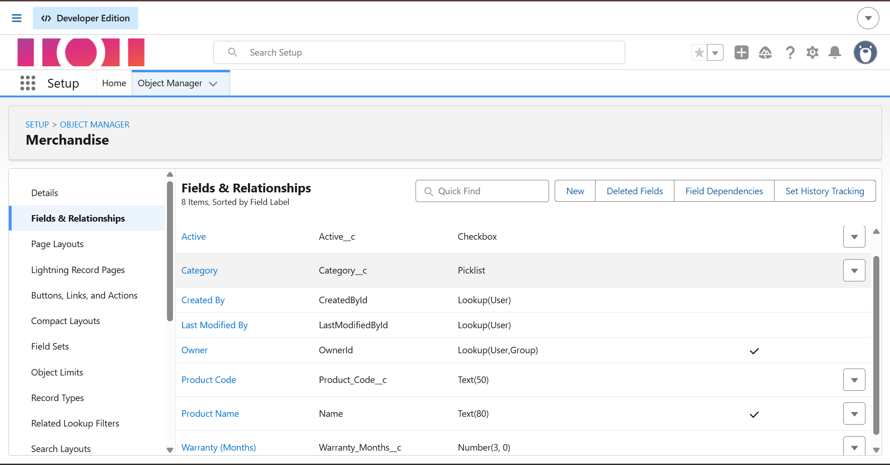
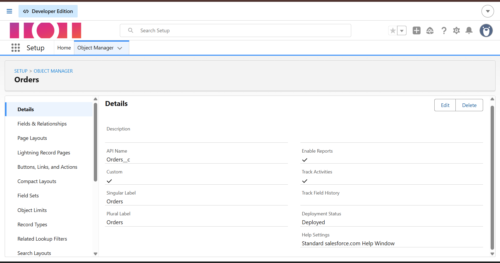
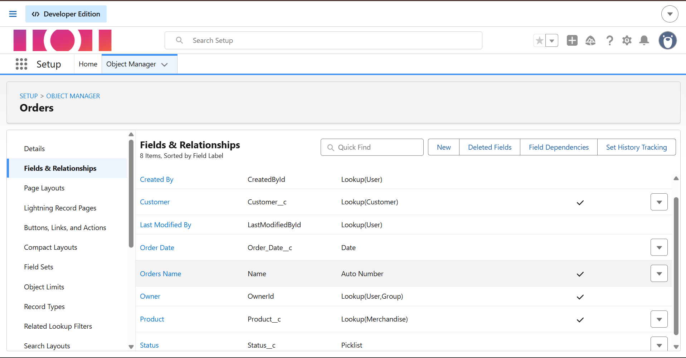
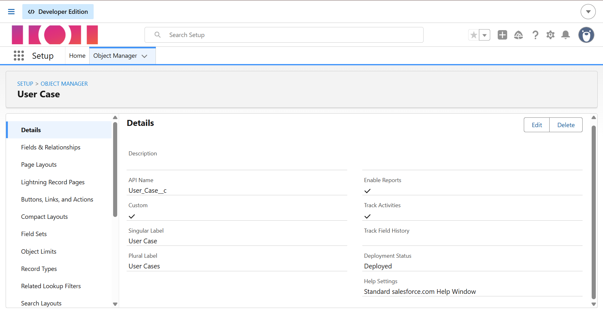
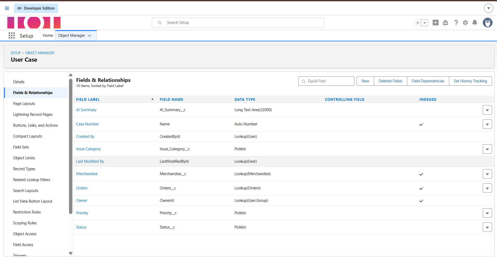
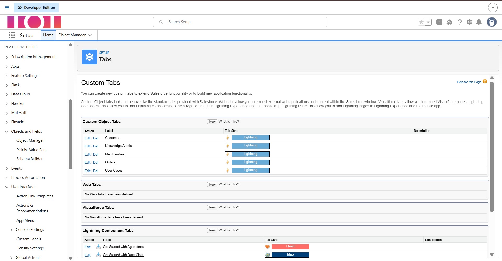

---

## 5. Validation Rules

**Rule 1 — `Damage_Requires_Priority`**
```
AND(
  ISPICKVAL(Issue_Category__c, "Damage"),
  ISBLANK(TEXT(Priority__c))
)
```
Error: *"Priority is mandatory for Damage cases."* (shown on Priority field)

**Rule 2 — `Warranty_Delivery_Requires_Priority`**
```
AND(
  OR(
    ISPICKVAL(Issue_Category__c, "Warranty"),
    ISPICKVAL(Issue_Category__c, "Delivery")
  ),
  ISBLANK(TEXT(Priority__c))
)
```
Error: *"Priority is mandatory for Warranty and Delivery cases"* (shown at top of page)

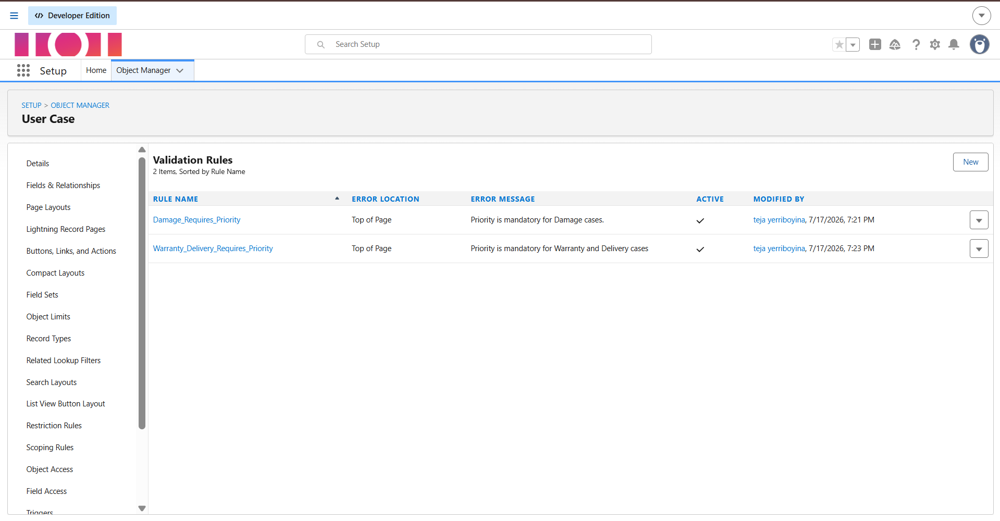

---

## 6. Automation (Flows & Queues)

**Queues:** `Damage Support Queue`, `Warranty Support Queue` — both support the User Case object.

**Flow 1 — Case Status and Type Check Flow**
- Trigger: User Case created or updated
- Assignment: sets `Status__c = Open`
- Decision: branches by `Issue Category` (Damage / Warranty)

**Flow 2 — Case Auto Assignment & SLA Flow**
- Trigger: User Case created
- Decision: checks if `Priority__c = High`
- Update Records: if High priority, auto-assigns case Owner

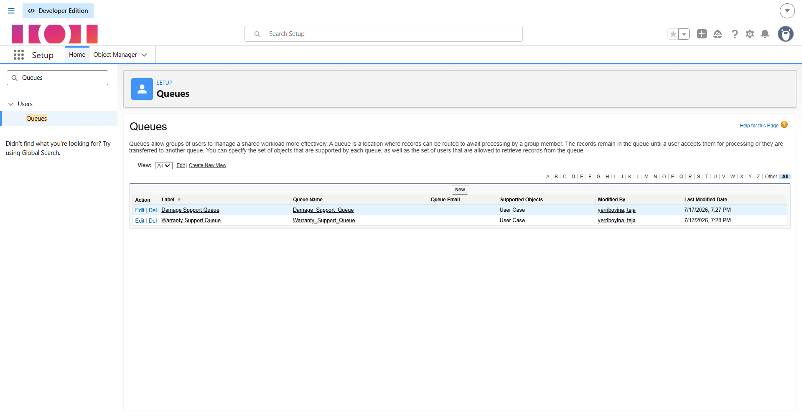
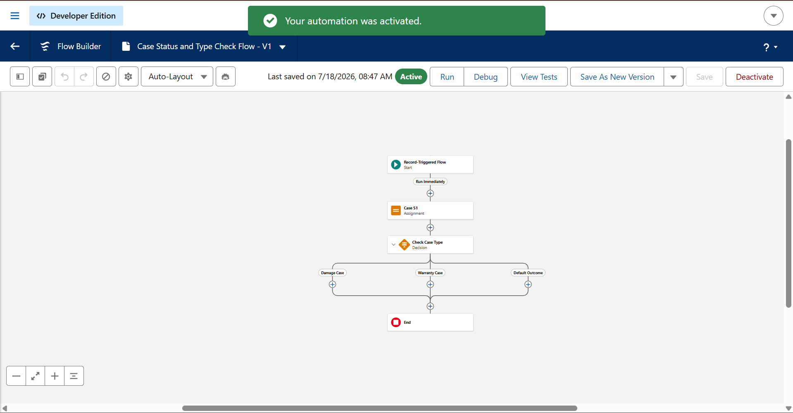
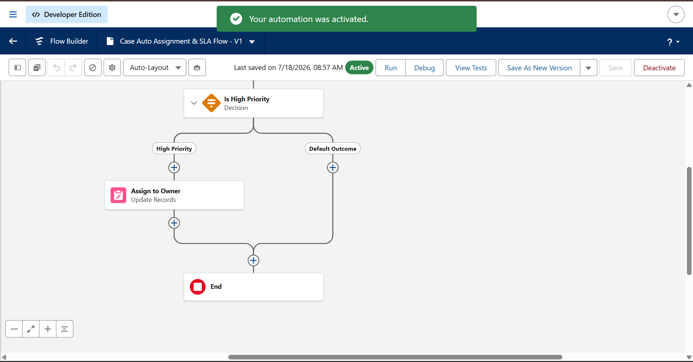

---

## 7. AI Component — Prompt Builder

- **Prerequisite:** Einstein Generative AI enabled via Einstein Setup.
- **Prompt Template:** `MetaDataInspection` (Field Generation type)
  - Object: User Case
  - Target Field: AI Summary
  - Model: GPT 5 Mini (Standard)
- **Prompt Logic:** Merges Case Number, Created Date, Status, Priority, and Issue Category into a natural-language instruction, generating a professional summary explaining the case status and key details for business users.
- **Deployment:** Assigned to the AI Summary field on the User Case Lightning Record Page via Lightning App Builder (Dynamic Forms), activated as the Org Default for Desktop and Phone.

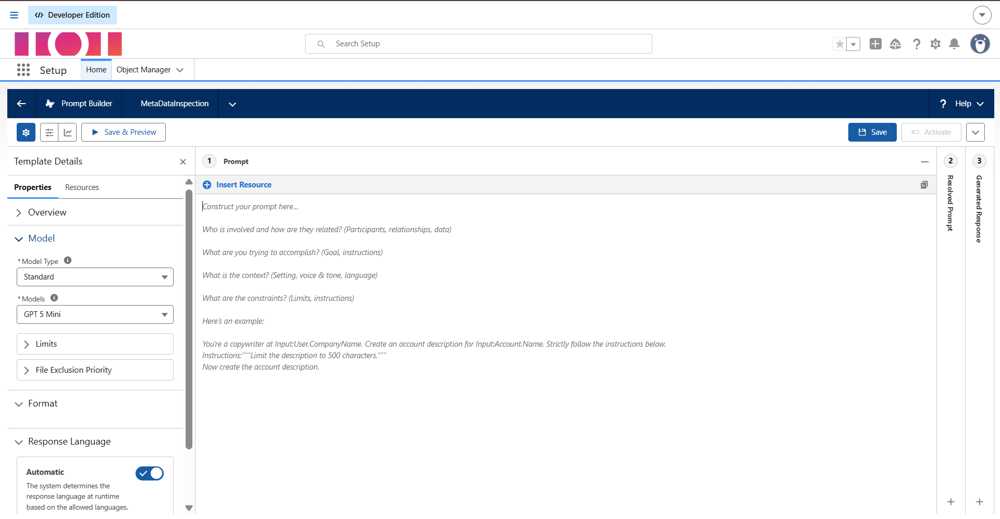
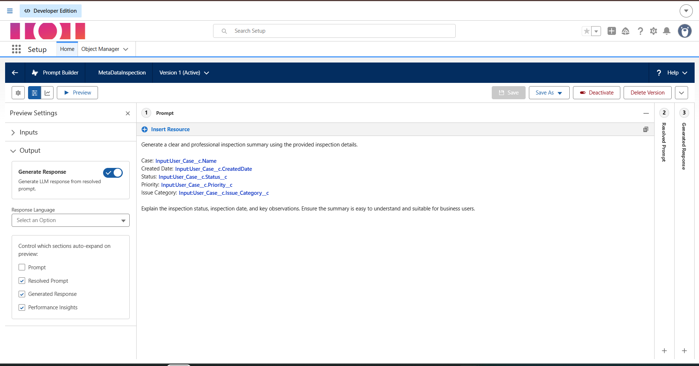
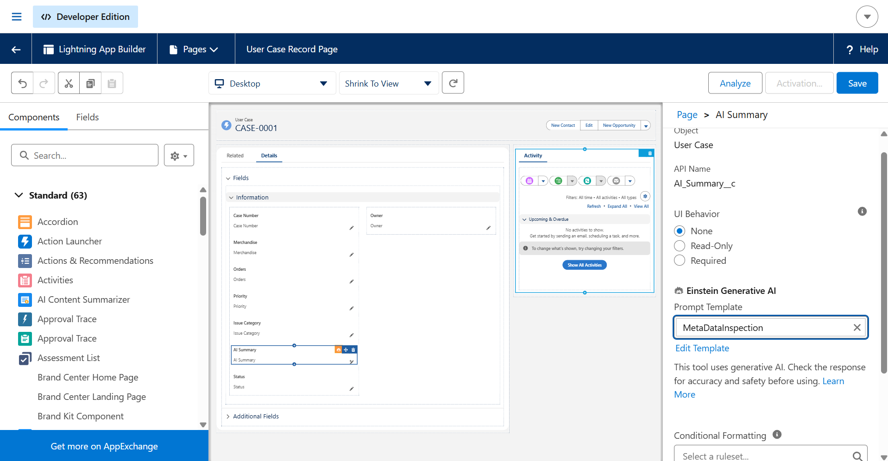

---

## 8. UI — Lightning App

- **App Name:** AI-Powered Customer Support & Service Automation
- **Navigation Items:** Home, Customer, Merchandise, Orders, User Case, Knowledge
- **Assigned Profiles:** System Administrator (all profiles)

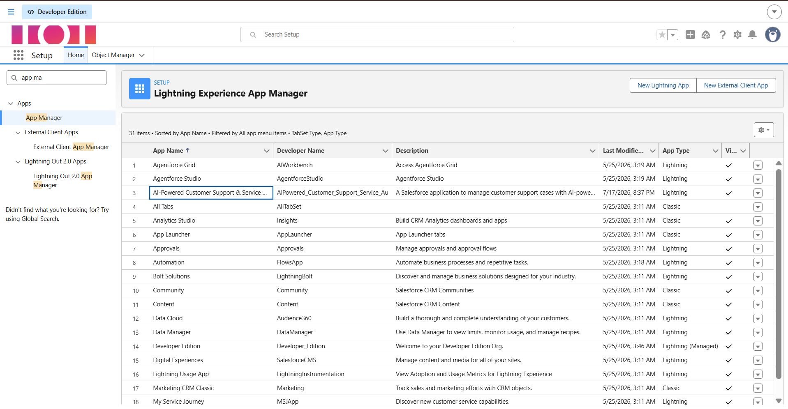

---

## 9. Security

- **Field-Level Security:** Reviewed on the System Administrator profile for the User Case object — all inspection fields (Priority, Issue Category, AI Summary) are visible and editable for authorized users.
- **Role-Based Access:** Queue membership restricts case visibility/ownership to the Damage Support Queue and Warranty Support Queue members.
- **Validation Rules:** Prevent incomplete/invalid data entry (see Section 5).

---

## 10. Testing Summary

| Test | Expected Result | Status |
|---|---|---|
| Create Damage case with blank Priority | Blocked by validation rule | ✅ Pass |
| Create Warranty/Delivery case with blank Priority | Blocked by validation rule | ✅ Pass |
| Create case → Status auto-set | Status = Open | ✅ Pass |
| Create High Priority case | Owner auto-assigned | ✅ Pass |
| Trigger AI Summary on User Case record | Summary generated and saved | ✅ Pass |

---

## 11. Maintenance & Monitoring

- Flows, validation rules, and queues are reviewed periodically as case volume/business needs evolve.
- Flow error emails and Salesforce reports are used to monitor automation health.
- AI response quality is periodically reviewed for accuracy.
- Issues are diagnosed, fixed in a sandbox, and validated before deployment to production.

---

## 12. Demo Video

🔗 *https://drive.google.com/file/d/1DiA7VtEjYJllCZh-PINYCQH9x6Zsknv3/view?usp=sharing*

---

## 13. Conclusion

This project demonstrates the use of Salesforce declarative tools (Custom Objects, Validation Rules, Flow Builder, Queues, Lightning App Builder) combined with Einstein Generative AI (Prompt Builder) to automate customer support case documentation — reducing manual effort, improving consistency, and enabling faster response times.

---

*Built on Salesforce Developer Edition as part of the AI-Powered Customer Support & Service Automation project.*
